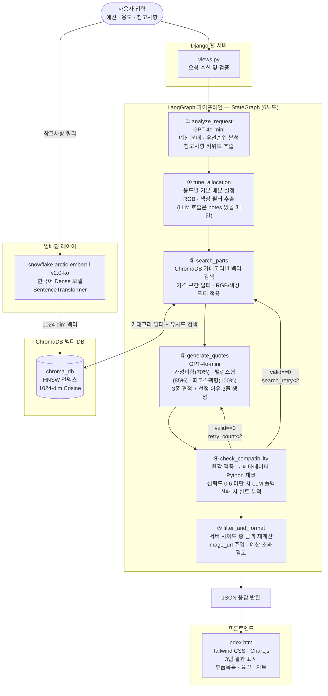
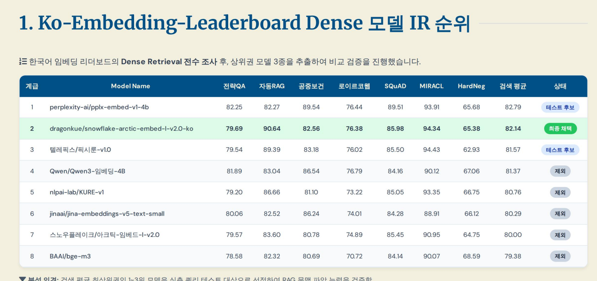
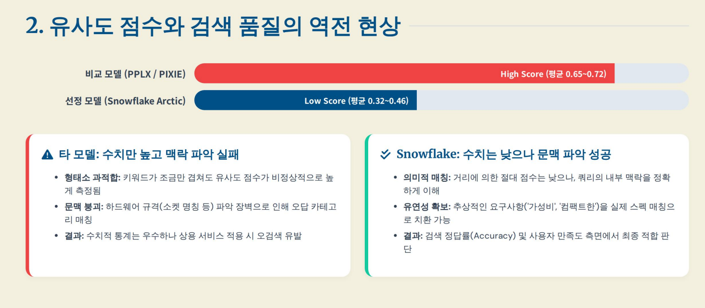
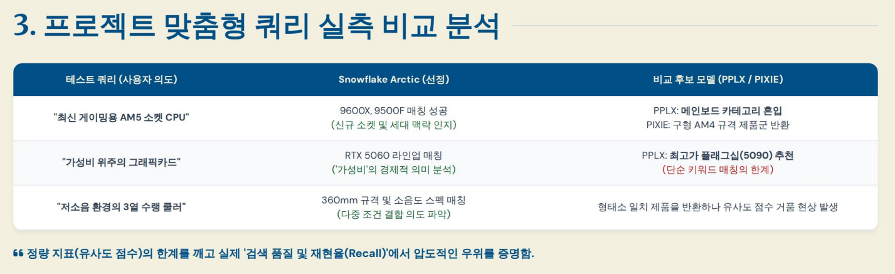
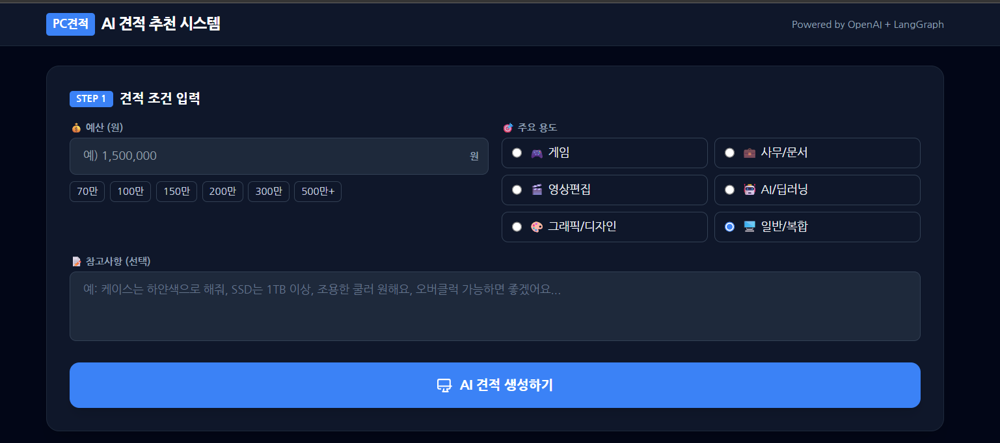
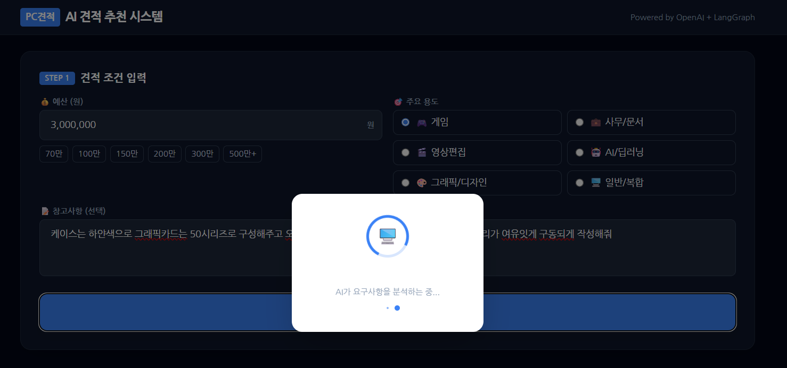
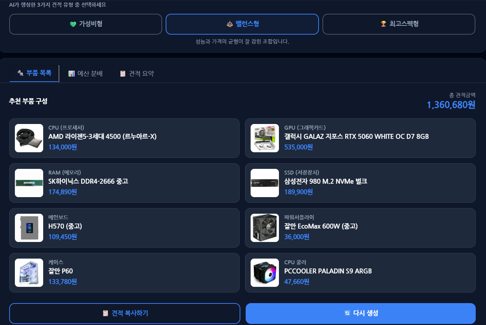
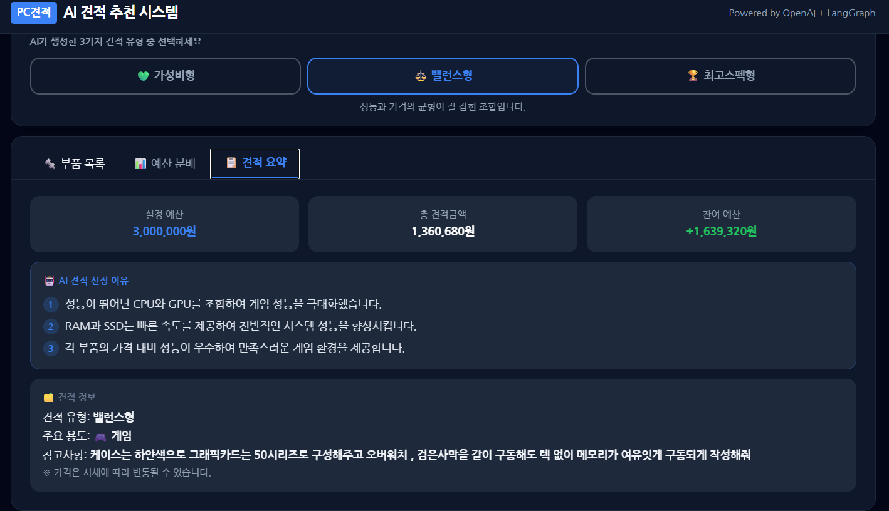

# PC 견적 추천 AI 시스템

> **LangGraph + OpenAI API + ChromaDB RAG** 기반의 사용자 맞춤형 PC 부품 견적 추천 시스템

---

## 목차

1. [프로젝트 개요](#프로젝트-개요)
2. [기술 스택](#기술-스택)
3. [전체 워크플로우](#전체-워크플로우)
4. [임베딩 모델 선택 이유](#임베딩-모델-선택-이유)
5. [주요 기능](#주요-기능)
6. [화면 구성](#화면-구성)
7. [프로젝트 구조](#프로젝트-구조)
8. [설치 및 실행](#설치-및-실행)

---

## 프로젝트 개요

사용자가 예산과 용도, 자유형식 참고사항을 입력하면 AI가 실시간으로 **가성비형 · 밸런스형 · 최고스펙형** 3종 PC 견적을 생성합니다.

- **RAG 파이프라인**: 실제 PC 부품 데이터를 ChromaDB 벡터 DB에 저장 후, 의미 기반 검색으로 부품을 추출
- **LangGraph 오케스트레이션**: 6개 노드로 구성된 상태 기반 파이프라인이 분석 → 배분 조정 → 검색 → 생성 → 검증 → 포맷 순으로 처리
- **OpenAI GPT-4o-mini**: 안정적인 견적 데이터 생성
- **Dense 임베딩 모델**: 자유형식 한국어 참고사항의 의미를 정확히 파악하는 한국어 특화 모델 적용

---

## 기술 스택

| 분류 | 기술 |
|------|------|
| **백엔드 프레임워크** | Django 4.2+ |
| **AI 오케스트레이션** | LangGraph 0.2+, LangChain Core 0.3+ |
| **LLM** | OpenAI GPT-4o-mini |
| **임베딩 모델** | `dragonkue/snowflake-arctic-embed-l-v2.0-ko` (1024-dim) |
| **벡터 DB** | ChromaDB (HNSW index, Cosine similarity) |
| **프론트엔드** | Tailwind CSS, Chart.js, SweetAlert2 |
| **환경 관리** | python-dotenv, .env 기반 시크릿 관리 |
| **데이터베이스** | SQLite (개발) / PostgreSQL (운영, 선택) |

---

## 전체 워크플로우



### 파이프라인 단계별 설명

| 단계 | 노드 | 역할 |
|------|------|------|
| ① | `analyze_request` | 예산을 CPU/GPU/RAM 등 카테고리별로 분배하고, 용도 우선순위와 참고사항의 핵심 키워드를 추출 |
| 1.5 | `tune_allocation` | 용도(gaming/office/video/ai/design/general)별 예산 배분 비율 설정. notes가 있으면 LLM이 RGB 요구·케이스 색상·비율 조정을 한번에 추출 |
| ② | `search_parts` | ChromaDB에서 카테고리별 벡터 검색. 카테고리 예산 ±범위 가격 필터 + RGB/색상 필터 적용. 재시도 시 failed_parts 제외 |
| ③ | `generate_quotes` | 검색된 부품 후보로 3종 견적 JSON 생성. 가성비형 ≤70%, 밸런스형 ≤85%, 최고스펙형 ≤100% 예산 상한 명시 |
| ④ | `check_compatibility` | ① 환각 검증(후보 목록 외 제품명 차단) → ② `compatibility.py` 메타데이터 Python 규칙 체크 → ③ 신뢰도 0.6 미만이면 LLM 폴백 |
| ⑤ | `filter_and_format` | 서버에서 부품 가격 직접 합산, image_url 주입, id 순 정렬, 예산 초과 경고 추가 |

### 3방향 재시도 로직

```
호환 견적 == 0
├── retry_count < 2    → generate_quotes 재시도 (실패 힌트 포함)
├── search_retry < 2   → search_parts 재시도 (실패 부품 제외)
└── 한도 초과          → filter_and_format (결과 강제 반환)
```

---

## 임베딩 모델 선택 이유

### 참고사항 필드가 Dense 모델을 필요로 하는 이유

사용자는 견적 요청 시 다음과 같은 **자유형식 한국어 참고사항**을 입력합니다.

```
"케이스는 하얀색으로 해줘"
"SSD는 1TB 이상이었으면 해"
"그래픽카드는 50시리즈로 부탁해"
"소음이 적은 쿨러로 골라줘"
```

이러한 문장은 **키워드 매칭(Sparse/BM25)으로는 검색 불가**합니다.

- "하얀색" → 부품 데이터에 "WHITE", "화이트" 등으로 기록되어 있어 단어가 다름
- "1TB 이상" → 범위 조건은 키워드 검색으로 표현 불가
- "50시리즈" → RTX 5060, RX 9070 등 실제 모델명과 의미적으로 연결해야 함
- "소음이 적은" → 저소음, dB 수치 등 의미적 유사성이 필요

따라서 **의미 기반 Dense Retrieval 모델이 필수**입니다.

---

### 모델 선택 근거: Ko-Embedding-Leaderboard 벤치마크

한국어 임베딩 모델 리더보드에서 Dense IR(Information Retrieval) 성능을 기준으로 후보를 선정했습니다.



> **Snowflake Arctic Embed KO (1024-dim)** 가 Dense IR 벤치마크 2위를 기록하며,  
> 무료 오픈소스 모델 중 최상위 성능임을 확인

---

### 유사도 점수만으로 판단하면 안 되는 이유

단순히 코사인 유사도 점수가 높다고 해서 검색 품질이 높은 것은 아닙니다.



| 모델 | 평균 유사도 점수 | 실제 검색 품질 |
|------|----------------|--------------|
| PPLX Embed v1 4B | 0.65 ~ 0.72 (높음) | 의미 이해 실패 — 엉뚱한 부품 반환 |
| PIXIE-Rune v1.0 | 0.65 ~ 0.72 (높음) | 의미 이해 실패 — 엉뚱한 부품 반환 |
| **Snowflake Arctic KO** | **0.32 ~ 0.46 (낮음)** | **의미 이해 성공 — 올바른 부품 반환** |

점수가 낮아도 **맥락을 제대로 이해하는 모델**이 실제 서비스에 적합합니다.

---

### 프로젝트 맞춤형 쿼리 실측 비교

실제 PC 부품 데이터셋에 프로젝트 특화 쿼리 3종을 직접 테스트한 결과입니다.



| 테스트 쿼리 | Snowflake Arctic KO | PPLX Embed v1 4B |
|------------|--------------------|--------------------|
| "최신 게이밍용 AM5 소켓 CPU" | ✅ Ryzen 7000 시리즈 반환 | ❌ AM4 소켓 구형 CPU 반환 |
| "가성비 위주의 그래픽카드" | ✅ 가성비 GPU 반환 | ❌ 관련 없는 부품 반환 |
| "저소음 환경의 3열 수랭 쿨러" | ✅ 360mm 수랭 쿨러 반환 | ❌ 공랭 쿨러 반환 |

**결론**: 한국어 의미 기반 검색 품질에서 Snowflake Arctic Embed KO가 압도적으로 우수하여 최종 채택

---

## 주요 기능

### 1. 3가지 유형의 견적 자동 생성

| 유형 | 예산 상한 | 성격 |
|------|---------|------|
| **가성비형** | 총 예산의 70% | 예산 대비 최대 성능, 필수 부품 중심 |
| **밸런스형** | 총 예산의 85% | 성능과 가격의 균형, 범용적 사용 최적화 |
| **최고스펙형** | 총 예산의 100% | 예산 한도까지 최고 성능 부품 사용 |

### 2. 용도별 예산 배분 (tune_allocation)

용도에 따라 카테고리별 예산 비율을 자동으로 설정합니다.

| 용도 | GPU | CPU | RAM | SSD | 메인보드 | 파워 | 케이스 | 쿨러 |
|------|-----|-----|-----|-----|---------|------|--------|------|
| gaming | 38% | 18% | 7% | 10% | 10% | 5% | 7% | 5% |
| office | 10% | 25% | 10% | 15% | 18% | 8% | 9% | 5% |
| video | 30% | 25% | 13% | 12% | 10% | 5% | 3% | 2% |
| ai | 50% | 15% | 12% | 10% | 7% | 4% | 1% | 1% |
| design | 35% | 22% | 12% | 12% | 10% | 5% | 3% | 1% |
| general | 28% | 22% | 10% | 12% | 12% | 7% | 6% | 3% |

### 3. 참고사항 자동 해석

notes(참고사항)에 특수 요구사항이 있으면 LLM이 자동으로 추출합니다.

- `"빛나는 케이스"` → `require_rgb=True` → RAM/케이스/쿨러를 RGB 제품으로 필터
- `"화이트 케이스"` → `require_color="white"` → 케이스를 흰색 제품으로 필터
- `"GPU 중요"` → `budget_allocation` 비율 자동 조정

### 4. 하이브리드 호환성 검증

```python
# 1단계: 환각 검증 — 후보 목록에 없는 제품명 차단
hallucinated = _validate_parts(quote, candidates)

# 2단계: ChromaDB 메타데이터 Python 규칙 체크
result = check_compat_meta(quote, candidates)
# → 소켓, DDR 타입, TDP+전력, GPU 권장 파워 검증

# 3단계: 신뢰도 < 0.6이면 LLM 폴백
if result["confidence"] < 0.6:
    result = _llm_compat_check(quote)
```

### 5. 서버 사이드 가격 계산

LLM이 반환하는 `total_price` 값의 신뢰성 문제를 해결하기 위해, 서버에서 각 부품 가격을 직접 합산합니다.

```python
def _calc_total_price(quote: dict) -> int:
    return sum(
        _parse_price_int(quote.get(cat, {}).get("price", 0))
        for cat in ["CPU", "GPU", "RAM", "SSD", "메인보드", "파워", "케이스", "쿨러"]
        if isinstance(quote.get(cat), dict)
    )
```

### 6. AI 견적 선정 이유 제공 (3문장 구조)

각 견적마다 LLM이 3문장으로 선정 이유를 요약합니다.

1. **핵심 부품 선정 근거** — CPU/GPU가 요구사항에 맞는 이유
2. **특별 요청 반영** — RGB/색상/다중실행 등 요청이 어떤 부품으로 충족됐는지
3. **포지셔닝** — 다른 견적 대비 이 유형의 장점

---

## 화면 구성

### 메인 입력 화면
예산, 사용 용도, 자유형식 참고사항을 입력하는 폼



---

### AI 분석 실행 화면
LangGraph 파이프라인이 실행되는 동안 표시되는 로딩 오버레이



---

### 견적 결과 — 부품 목록
카테고리별 부품 이름, 가격, 이미지가 표시되는 결과 탭



---

### 견적 결과 — 견적 요약
총 금액, 예산 대비 잔액, AI 선정 이유 3줄이 표시되는 요약 탭



---

## 프로젝트 구조

```
pc_assembly/                      ← 루트 폴더
├── pc_assembly/                  ← Django 프로젝트 루트 (manage.py 위치)
│   ├── main/                     ← Django 앱 (핵심 로직)
│   │   ├── graph.py              # LangGraph 6-노드 파이프라인 핵심 로직
│   │   ├── compatibility.py      # ChromaDB 메타데이터 기반 호환성 검증 모듈 (신규)
│   │   ├── views.py              # Django 뷰 — 요청 수신 및 에러 핸들링
│   │   ├── config.py             # 환경변수 로드 (OpenAI API Key, HF_OFFLINE 등)
│   │   └── templates/main/
│   │       └── index.html        # 프론트엔드 (Tailwind CSS + Chart.js)
│   ├── pc_assembly/              ← Django 설정 패키지
│   │   ├── settings.py
│   │   └── urls.py
│   └── manage.py
├── vectordb.py                   ← ChromaDB 벡터 DB 구축 스크립트
├── md모음/                       ← 개발 노트 및 파이프라인 실행 자동 로그 (신규)
│   ├── 랭그래프.md               # 파이프라인 실행 기록 자동 누적
│   ├── 벡터DB생성.md
│   ├── 임베딩결과.md
│   └── ...
├── docs/
│   ├── screenshots/              # 실행 화면 캡처
│   └── slides/                   # 모델 선택 근거 슬라이드
├── .env
├── .env.example
└── .gitignore
```

> `chroma_db/` 폴더는 `.gitignore`에 포함되어 있습니다.  
> HNSW 바이너리 인덱스(`.bin` 파일)는 PC마다 `vectordb.py`로 재구축해야 합니다.

---

## 설치 및 실행

### 1. 환경변수 설정

```bash
cp .env.example .env
```

`.env` 파일을 열고 OpenAI API 키를 입력합니다:

```env
OPENAI_API_KEY=sk-proj-...
OPENAI_MODEL=gpt-4o-mini
HF_OFFLINE=0
DJANGO_SECRET_KEY=your-django-secret-key
```

> `HF_OFFLINE=0`: 최초 실행 시 임베딩 모델(~1GB)을 자동 다운로드  
> `HF_OFFLINE=1`: 이미 캐시된 모델 사용 (재다운로드 방지)

### 2. 의존성 설치

```bash
pip install -r requirements.txt
```

### 3. 벡터 DB 구축

```bash
python vectordb.py
```

> `가공데이터/임베딩/` 폴더의 `.txt` 파일을 읽어 ChromaDB를 구축합니다.

### 4. Django 마이그레이션 및 서버 실행

```bash
cd pc_assembly
python manage.py migrate
python manage.py runserver
```

브라우저에서 `http://127.0.0.1:8000` 접속

---

## 환경별 설정 차이

| 항목 | 개발 환경 | 운영 환경 |
|------|---------|---------|
| **데이터베이스** | SQLite (`db.sqlite3`) | PostgreSQL |
| **임베딩 모델** | `HF_OFFLINE=0` (자동 다운로드) | `HF_OFFLINE=1` (캐시 사용) |
| **벡터 DB** | `vectordb.py` 로컬 재구축 | 동일 (`chroma_db/` 재구축 필요) |

---

## 주요 설계 결정

### 호환성 검증: LLM only → 하이브리드

초기에는 GPT-4o-mini가 직접 호환성을 판단했습니다. 문제는 LLM이 소켓 규격을 틀리거나, 전력 계산을 잘못하는 경우가 생겼기 때문에 `compatibility.py`를 분리해 Python 규칙 기반 체크를 1차로 수행하고, 메타데이터가 불완전한 경우(신규 세대 부품 등)에만 LLM을 폴백으로 사용합니다.

### LLM 환각 방지

LLM이 후보 목록에 없는 가상의 제품명을 생성하는 경우(`_validate_parts`)를 명시적으로 차단합니다. 환각 부품이 있는 견적은 호환성 검증 전에 폐기하고 실패 힌트에 누적합니다.

### 재시도 우선순위 설계

1. **generate_quotes 재시도** — 같은 후보 풀에서 다른 조합 선택 (LLM에게 실패 이유 전달)
2. **search_parts 재시도** — 실패한 부품들을 제외하고 새 후보 탐색
3. **포기** — 빈 결과보다 호환 미보장이지만 결과를 반환하는 것이 UX상 낫다고 판단

### 벡터 DB: ChromaDB + HNSW

- 로컬 PersistentClient로 외부 서버 없이 운용
- 카테고리 메타데이터 필터링으로 검색 정밀도 향상
- `socket`, `ddr_type`, `tdp`, `wattage`, `has_rgb`, `color` 등 하드웨어 메타데이터를 ChromaDB에 함께 저장해 Python 레벨 호환성 검증에 재사용

### 서버 사이드 가격 계산

LLM의 `total_price` 필드는 신뢰도가 낮아 서버에서 부품별 가격을 직접 합산합니다.  
`_parse_price_int()` 함수로 "1,360,680원" 형식의 문자열도 안전하게 파싱합니다.
